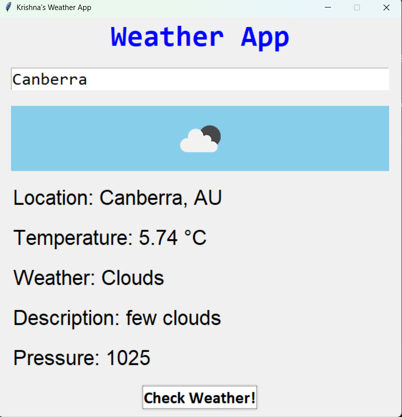

# Python Weather App

Python weather app is one of my very old projects which I made in 2021. It is a simple gui weather app which uses openweathermap api for fetching data for any particular city.

As always it uses python tkinter for it's GUI.

I swear I haven't touched that old ass code before uploading apart from hiding the api key in the .env file, yk I can't upload that lol.

Also do pip install dotenv module, I ain't putting requirements.txt

To run it just execute ```python app.py```



